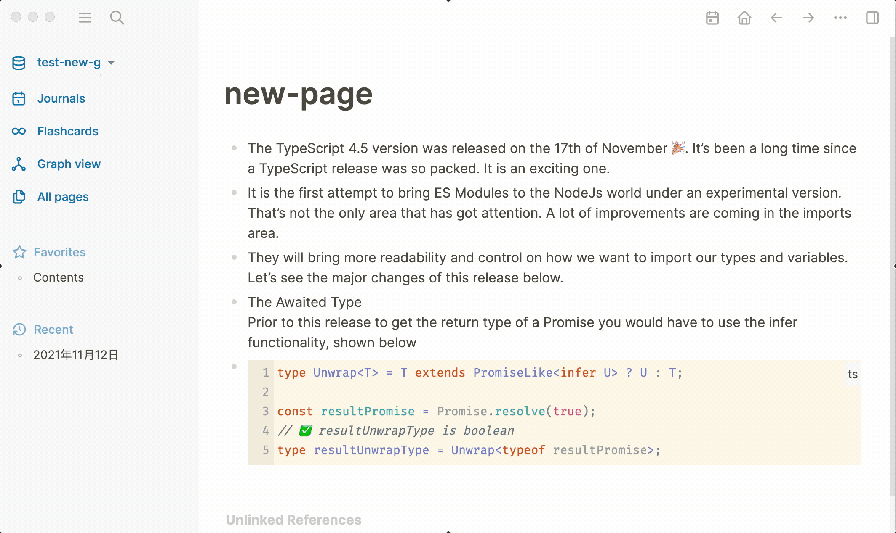

## A Translator Sample

This is sample that show you how to use float ui container to display custom content.

### Demo

### API

##### Logseq.App

- `onInputSelectionEnd: IUserHook<{ caret: any; end: number; point: { x: number; y: number }; start: number; text: string }, IUserOffHook>`

### Running the Sample

> 🏷 Minimal version of App [0.4.6](https://github.com/logseq/logseq/releases/tag/0.4.6) !

- `yarn && yarn build` in terminal to install dependencies.
- `Load unpacked plugin` in Logseq Desktop client.

### License

MIT
