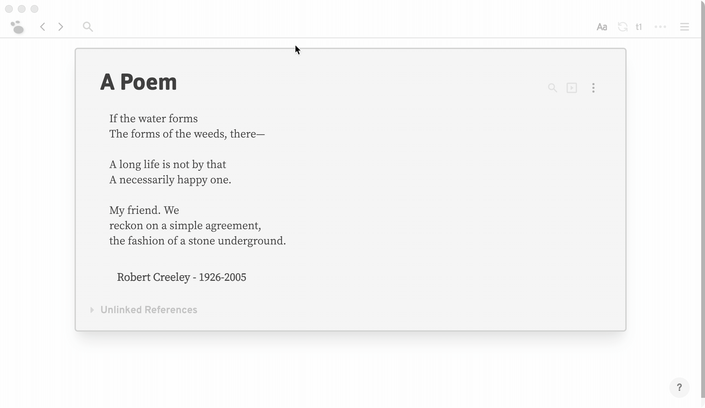

## Custom Editor Fonts Sample

🛠 This is a plugin that shows how to define custom appearance of editor and persist settings state.

### Demo

### API

##### Logseq

- `provideUI (ui: UIOptions): this`
- `provideStyle (style: StyleString | StyleOptions): this`
- `updateSettings (attrs: Record<string, any>): void`
- `setMainUIInlineStyle (style: CSSStyleDeclaration): void`

### Running the Sample

- `npm install && npm run build` in terminal to install dependencies.
- `Load unpacked plugin` in Logseq Desktop client.
