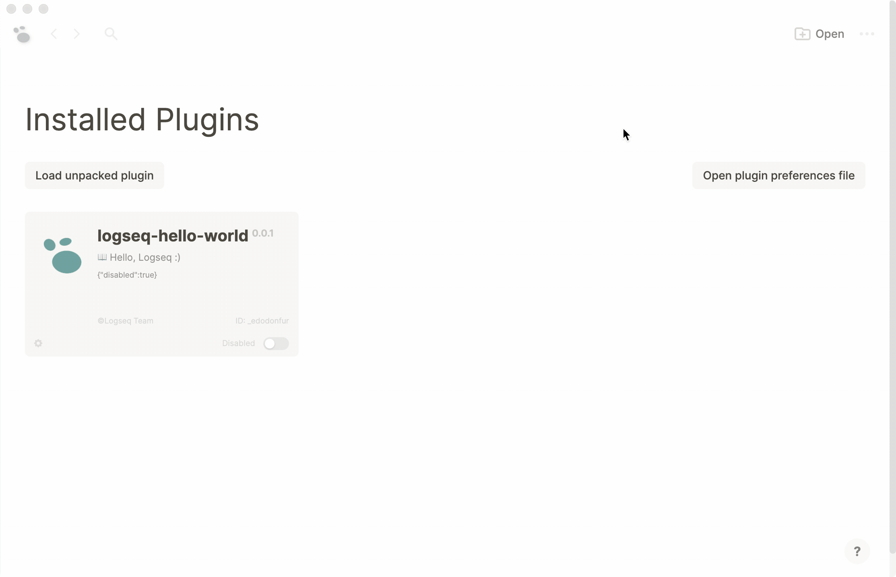

## Hello World Sample

This is a Hello World sample that just get you started :)

### Demo

### API

##### Logseq

- `ready (callback?: (e: any) => void | {}): Promise<any>`

##### Logseq.App

- `showMsg: (content: string, status?: 'success' | 'warning' | string) => void`

### Running the Sample

- `Load unpacked plugin` in Logseq Desktop client.
