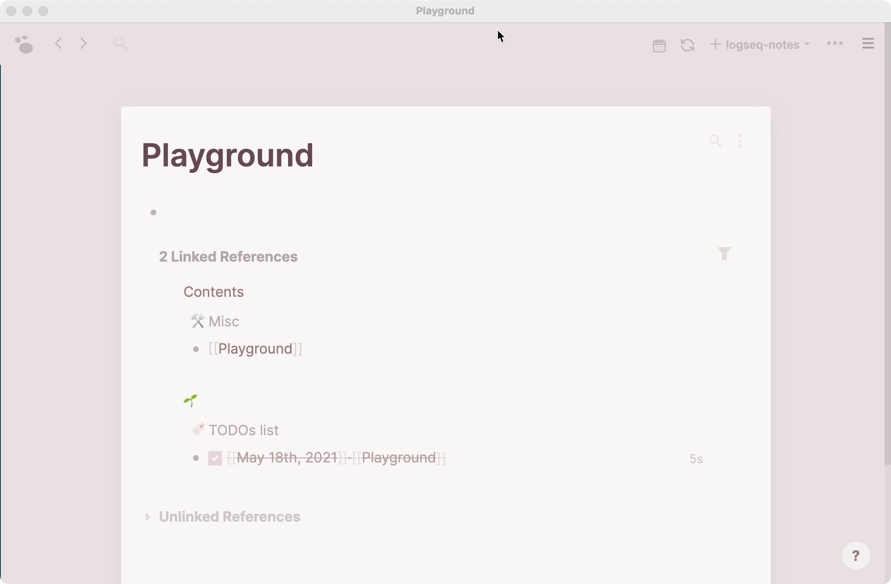

## Journals Calendar Sample

This is a journals calendar sample that show you how to use DB query api :)

### 👉 Maintain here https://github.com/xyhp915/logseq-journals-calendar

### Demo

### API

##### Logseq.DB

- `datascriptQuery: <T = any>(query: string) => Promise<T>`

### Running the Sample

- `npm install && npm run build` in terminal to install dependencies.
- `Load unpacked plugin` in Logseq Desktop client.
